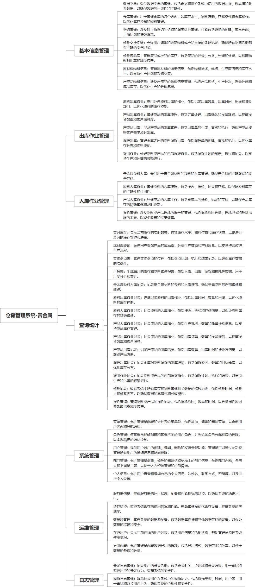

 

    
 

公司拥有上百套具有自主知识产权的软件系统，详情请查看码云首页或公司官网

 
<h1>仓储管理系统（WMS）-生产企业版</h1>

<a href="https://www.haishi.net.cn/">公司官网</a> ｜ <a href="https://www.haishi.net.cn/">在线体验</a>

 

## 系统介绍

工厂-仓储管理系统-贵金属等物品仓库管理
---
本项目名称为仓储管理系统-贵金属，是针对贵金属仓储管理业务进行信息化管理的系统。该系统适用于贵金属相关企业的仓储管理，涵盖了从物料入库、存储、出库到库存盘点、报表统计等全流程管理。
本项目的用户主要为企业内部人员，包含管理员、仓库管理员、操作员等角色，实现对贵金属库存的精准管理、提高出入库效率、降低损耗、实时掌握库存情况等目标。
- 管理端：企业内部管理员、仓库管理员、操作员等角色使用，可以进行贵金属领料入库、原料入库、产品入库、原料出库、产品出库、调拨出库、库存查询、报表统计等操作。
---
                

## 系统功能介绍

### 系统包含终端说明

管理端（WEB）

| 序号 | 模块 | 模块说明 |
| --- | --- | --- |
| 1 | GC-WMS-GJS-MANAGE | 管理端 |
| 2 | GC-WMS-GJS-SERVER | 服务端 |

### 系统功能结构

### 系统功能说明

- 贵金属领料入库管理
- 原材料及产成品出入库管理
- 库存盘点及报表统计
- 报耗管理

## 系统主要界面

## 系统技术说明

### 代码模块说明

| 序号 | 目录 | 目录说明 |
| --- | --- | --- |
| 1 | GC-WMS-GJS-SERVER/src | -- |

### 系统技术选型

#### 开发语言/框架

JAVA（JDK1.8）
前端框架：VUE2
框架：SpringBoot2.x
系统结构：单体应用

#### 服务中间件

Nginx
Tomcat

#### 数据库

MySQL（5.7+）

#### 其他说明

无

## 系统演示/商用

请扫码添加客服微信获取演示地址和系统详细资料。

如果您想基于仓储管理系统（WMS）-生产企业版进行商业化交付或定制开发服务，我们提供有偿的技术服务支持，合作模式不限，欢迎沟通！

公司官网地址： <a href="https://www.haishi.net.cn/">https://www.haishi.net.cn</a>

联系客服获取专业回答。

## 使用须知

1、 本项目商用必须获得版权所有者的授权。

2、 未经允许本项目代码不允许二次出售。

